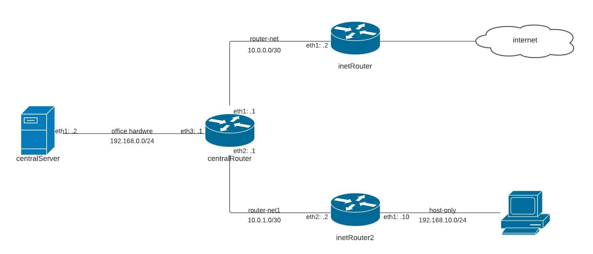
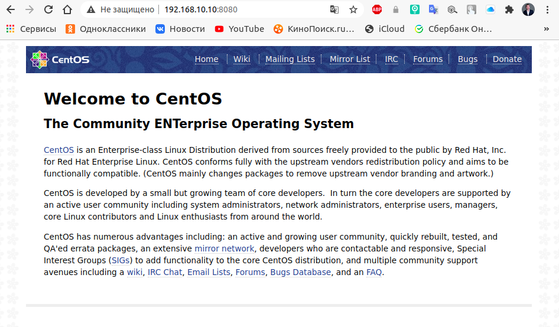

## Стенд для настройки файрвалл с использованием iptables/firewalld.

Цель: Сценарии iptables
1) реализовать knocking port
- centralRouter может попасть на ssh inetrRouter через knock скрипт
пример в материалах
2) добавить inetRouter2, который виден(маршрутизируется (host-only тип сети для виртуалки)) с хоста или форвардится порт через локалхост
3) запустить nginx на centralServer
4) пробросить 80й порт на inetRouter2 8080
5) дефолт в инет оставить через inetRouter

* реализовать проход на 80й порт без маскарадинга


### Реализация.

#### 1. knocking port
IP Forwarding
```
[root@inetRouter ~]# echo net.ipv4.ip_forward = 1 >> /etc/sysctl.conf
[root@inetRouter ~]# sysctl -p
```
Установим пакет для работы с iptables
```
[root@inetRouter ~]# yum install -y iptables-services && systemctl enable --now iptables
```
Настройка ssh
```
[root@inetRouter ~]# sed -i 's/^PasswordAuthentication.*$/PasswordAuthentication yes/' /etc/ssh/sshd_config && systemctl restart sshd.service
```
Настроим Port Knocking для servera `inetRouter`. Создадим правило и добавим сквозной трафик между сетевыми интерфейсами `eth0` и `eth1` на сервере `inetRouter`.
```
[root@inetRouter ~]# vi /etc/sysconfig/iptables.rules
```
```
*nat
:PREROUTING ACCEPT [0:0]
:INPUT ACCEPT [0:0]
:OUTPUT ACCEPT [0:0]
:POSTROUTING ACCEPT [0:0]
-A POSTROUTING -o eth0 -j MASQUERADE
COMMIT
*filter
:INPUT DROP [0:0]
:FORWARD ACCEPT [0:0]
:OUTPUT ACCEPT [0:0]
:TRAFFIC - [0:0]
:SSH-INPUT - [0:0]
:SSH-INPUTTWO - [0:0]

-A INPUT -j TRAFFIC
-A TRAFFIC -p icmp --icmp-type any -j ACCEPT
-A TRAFFIC -m state --state ESTABLISHED,RELATED -j ACCEPT
-A TRAFFIC -m state --state NEW -m tcp -p tcp --dport 22 -m recent --rcheck --seconds 30 --name SSH2 -j ACCEPT
-A TRAFFIC -m state --state NEW -m tcp -p tcp -m recent --name SSH2 --remove -j DROP
-A TRAFFIC -m state --state NEW -m tcp -p tcp --dport 9991 -m recent --rcheck --name SSH1 -j SSH-INPUTTWO
-A TRAFFIC -m state --state NEW -m tcp -p tcp -m recent --name SSH1 --remove -j DROP
-A TRAFFIC -m state --state NEW -m tcp -p tcp --dport 7777 -m recent --rcheck --name SSH0 -j SSH-INPUT
-A TRAFFIC -m state --state NEW -m tcp -p tcp -m recent --name SSH0 --remove -j DROP
-A TRAFFIC -m state --state NEW -m tcp -p tcp --dport 8881 -m recent --name SSH0 --set -j DROP
-A SSH-INPUT -m recent --name SSH1 --set -j DROP
-A SSH-INPUTTWO -m recent --name SSH2 --set -j DROP
-A TRAFFIC -j DROP
COMMIT
```
Сохраним правила iptables
```
[root@inetRouter ~]# iptables-restore < /etc/sysconfig/iptables.rules
[root@inetRouter ~]# service iptables save
```
Добавим маршрут 
```
[root@inetRouter ~]# ip route add 192.168.0.0/24 via 10.0.0.1
[root@inetRouter ~]# ip route add 10.0.1.0/24 via 10.0.0.1
[root@inetRouter ~]# systemctl restart network
[root@centerRouter ~]# ip route add 192.168.10.0/24 via 10.0.1.2
[root@centerRouter ~]# systemctl restart network
```
Настройка для работы сервера `centerRouter`
IP Forwarding
```
[root@centerRouter ~]# echo net.ipv4.ip_forward = 1 >> /etc/sysctl.conf
[root@centerRouter ~]# sysctl -p
```
Настройка сетевого интерфейса
```
[root@centerRouter ~]# echo DEFROUTE="no" >> /etc/sysconfig/network-scripts/ifcfg-eth0 && systemctl restart network
[root@centerRouter ~]# echo GATEWAY=10.0.0.2 >> /etc/sysconfig/network-scripts/ifcfg-eth1 && systemctl restart network
```
Стучаться на сервер с помощью утилиты `nmap` и скрипта.
```
[root@centerRouter ~]# yum install -y nmap
```
```
[root@centerRouter ~]# vi /home/vagrant/knock.sh
```
```
#!/bin/bash
HOST=$1
shift
for ARG in "$@"
do
        sudo nmap -Pn --max-retries 0 -p $ARG $HOST
done
```
```
[root@centerRouter ~]# chmod +x /home/vagrant/knock.sh
```
Подключимся к серверу `inetRouter` с помощью скрипта
```
[root@centralRouter ~]# /home/vagrant/knock.sh 10.0.0.2 8881 7777 9991 ; ssh vagrant@10.0.0.2
```
#### 2. Проброс портов на сервере `inetRouter2`



Установим `nginx` на сервере `centrallServer`
```
[root@centralServer ~]# yum install -y epel-release
[root@centralServer ~]# yum install -y nginx
[root@centralServer ~]# systemctl enable --now nginx
```
Установим пакет для работы с iptables
```
[root@inetRouter2 ~]# yum install -y iptables-services && systemctl enable --now iptables
```
Добавим маршрут 
```
[root@inetRouter2 ~]# ip route add 192.168.0.0/24 via 10.0.1.1
[root@inetRouter2 ~]# systemctl restart network
```
IP Forwarding
```
[root@centerRouter2 ~]# echo net.ipv4.ip_forward = 1 >> /etc/sysctl.conf
[root@centerRouter2 ~]# sysctl -p
```

Пробросим порты на сервере `inetRouter2`
```
[root@inetRouter2 ~]# iptables -t nat -A PREROUTING -i eth2 -p tcp --dport 8080 -j DNAT --to 192.168.0.2:80
[root@inetRouter2 ~]# iptables -F
[root@inetRouter2 ~]# service iptables save
```
Проверим


Основным роутерем для выхода в инет являеться сервер `centralRouter`
```
[root@centralServer ~]# traceroute ya.ru
```
```
traceroute to ya.ru (87.250.250.242), 30 hops max, 60 byte packets
 1  _gateway (192.168.0.1)  0.385 ms  0.342 ms  0.317 ms
 2  10.0.0.2 (10.0.0.2)  0.522 ms  0.496 ms  0.473 ms
 3  * * *
 4  * * *
 5  * * *
 6  diamond-a.sunlink.ru (87.244.33.241)  7.149 ms  2.289 ms  2.257 ms
 7  tst-r3.sunlink.ru (87.244.0.20)  2.280 ms  2.321 ms  2.297 ms
 8  tla01.transtelecom.net (217.150.57.98)  5.957 ms  5.993 ms  5.376 ms
 9  10.99.99.97 (10.99.99.97)  5.870 ms  7.628 ms 10.99.99.9 (10.99.99.9)  7.561 ms
10  Yandex-gw.transtelecom.net (188.43.3.213)  9.924 ms  10.074 ms  10.129 ms
11  * 10.4.4.1 (10.4.4.1)  18.489 ms *
12  ya.ru (87.250.250.242)  15.729 ms  14.023 ms  15.029 ms

```

#### Проверка задания

1. Выполнить `vagrant up && ansible-playbook network.yml`.
2. На сервере `centralRouter` выполнить `/home/vagrant/knock.sh 10.0.0.2 8881 7777 9991 ; ssh vagrant@10.0.0.2` и ввести пароль `vagrant`, подключимся к серверу `inetRouter`.
3. В браузере зайти по адресу http://192.168.10.10:8080.

Ссылка на дополнительную информацию
- [Port knocking](https://otus.ru/nest/post/267/?utm_source=partners&utm_medium=cpa&utm_campaign=otus&utm_term=admitad&admitad_uid=5eaa68e9c1ebffe6351db9b91711aa55)
- [Port knocking](https://wiki.archlinux.org/index.php/Port_knocking)
